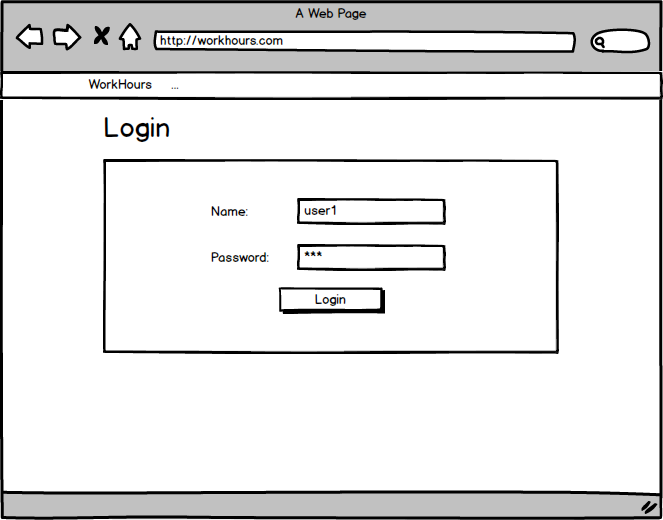

# Ruby on Rails 1. házi (Specifikáció)

## Feladatleírás
A félévre kitűzött feladatom egy munkaidő nyilvántartó rendszer elkészítése. Az összegyűjtött adatok tárolásáért, illetve kezeléséért egy központi szerver felelős, melyet egy webes felületen keresztül lehet elérni. A felhasználók ezek rögzíthetik az egyes projektek egyes feladatain eltöltött munkaidejüket. Ezen felül lehetőség van saját korábban lejelentett tételek megtekintésére, módosítására.

## Entitások
Az oldal négy különféle entitást kezel. Ezek a rekordok, a felhasználók, feladatok és projektek.

### Felhasználók (user)
Ők adják az oldal alapját, ők azok akik ezt használni fogják. A felhasználókról alapvető információkat tárol a rendszer, mint név, felhasználónév, jelszó. Ezen kívül két nagyobb csoportra lehet őket osztani, aszerint, hogy egyszerű felhasználó, aki csak a saját rekordjait láthatja, vagy adminisztrátori jogosultsággal rendelkezik, aki minden felhasználó adatait láthatja és szerkesztheti.

### Projektek (project)
A projektek egy nagyobb feladat csoportot foglalnak egybe, melyek valamilyen logikai kapcsolatban vannak egymással. A projektekről a nevüket szükséges tárolni a rendszerben.

### Feladatok (issue)
A feladatok adják az oldal másik fontos alapját. Ide lehet felvenni egy-egy "munkát", amit meg kell csinálni. Mindegyikhez tartozik egy név, egy bővebb leírás és hogy melyik projekthez tartozik.

### Rekordok (record)
Ezek azok melyek tartalmazzák az egyes felhasználók melyik feladattal mennyi időt töltöttek. Valójában egy kapcsolótábla a felhasználók és a feladatok között, melyek mellett olyan plusz információt tartalmaz, hogy mikor és mennyi ideig történt a munkavégzés.

## Oldalak
Az entitások közül mind a felhasználókhoz, projektejhez, feladatokhoz és rekordokhoz tartorik egy-egy listázó, részletes és szerkesztő felület. Mivel ezek csak az entitások különbözősége miatt beviteli mezők szintjén térnek el, így elégségesnek érzem minden művelethez egy mockup csatolását.

Bejelentkezés után minden oldalon van egy fix navigációs sáv, ahonnan elérhető a főoldal, a projektek listázása, munkaidő felvitele és a profil szerkesztése.

### Bejelentkezés

	

### Listázás

	

- Projektek listázása során elérhetővé válik minden projekthez a szerkesztési felület, valamint a hozzá tartozó feladatok listázása.
- Feladatok listázása során az egyes feladatok szerkesztési felületére van további hivatkozás.

### Szerkesztés

	

### Létrehozás

	

